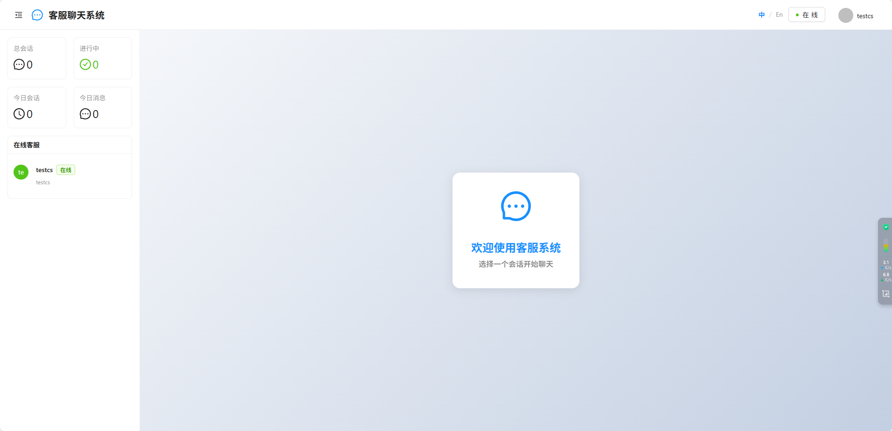
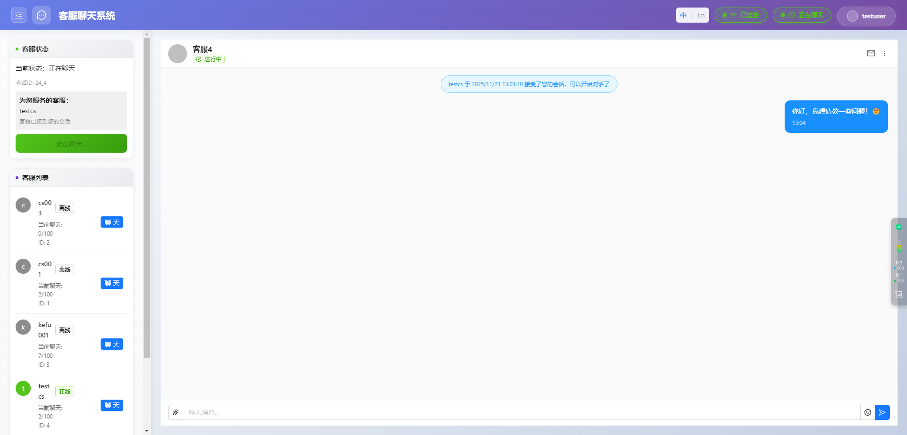
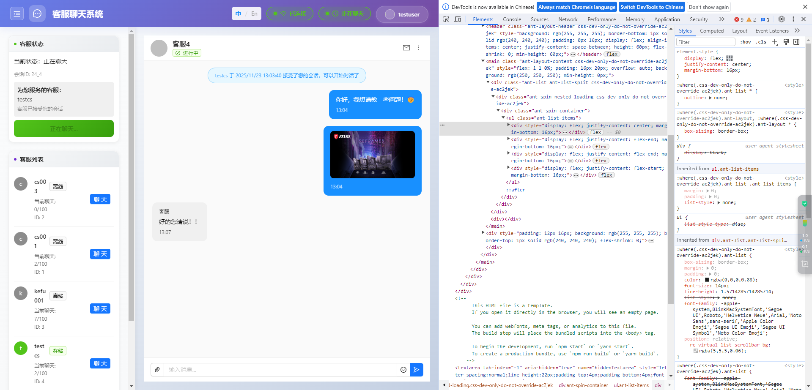
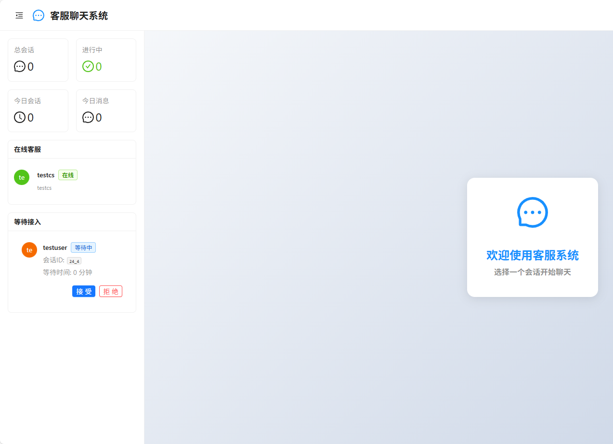
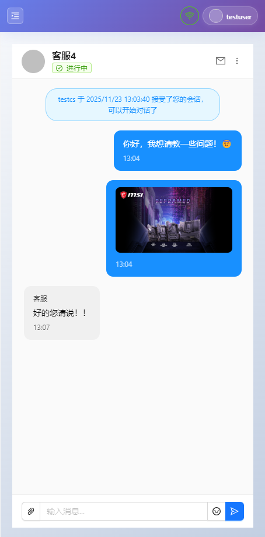
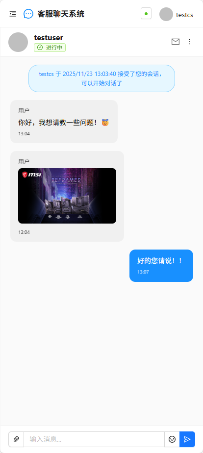

# 客服聊天系统 (Customer Service Chat)

一个基于 React + TypeScript 的现代化客服聊天系统，支持实时消息通信、多语言、移动端适配等功能。

## 技术栈

### 核心框架

- **React** 19.2.0 - 前端UI框架
- **TypeScript** 5.3.3 - 类型安全的JavaScript超集
- **React Router** 7.9.4 - 单页应用路由管理

### UI组件库

- **Ant Design** 5.27.6 - 企业级UI设计语言和组件库
- **@ant-design/icons** 6.1.0 - Ant Design图标库

### 实时通信

- **Socket.IO Client** 4.8.1 - WebSocket实时双向通信

### 工具库

- **Axios** 1.13.0 - HTTP客户端，用于API请求
- **dayjs** 1.11.18 - 轻量级日期时间处理库
- **emoji-picker-react** 4.15.0 - 表情选择器组件

### 国际化

- **i18next** 25.6.0 - 国际化框架
- **react-i18next** 16.2.3 - React的i18next绑定
- **i18next-browser-languagedetector** 8.2.0 - 浏览器语言检测

### 构建工具

- **Create React App** 5.0.1 - React应用脚手架
- **http-proxy-middleware** 3.0.5 - 开发环境代理中间件

### 开发工具

- **vconsole** 3.15.1 - 移动端调试工具

## 项目截图

### PC端界面

#### 首页



#### PC端聊天界面



#### 聊天界面示例1


#### 聊天界面示例2



#### 会话接受界面



### 移动端界面

#### 移动端聊天界面1



#### 移动端聊天界面2



## Available Scripts

In the project directory, you can run:

### `npm start`

Runs the app in the development mode.\
Open [http://localhost:3000](http://localhost:3000) to view it in the browser.

The page will reload if you make edits.\
You will also see any lint errors in the console.

### `npm test`

Launches the test runner in the interactive watch mode.\
See the section about [running tests](https://facebook.github.io/create-react-app/docs/running-tests) for more information.

### `npm run build`

Builds the app for production to the `build` folder.\
It correctly bundles React in production mode and optimizes the build for the best performance.

The build is minified and the filenames include the hashes.\
Your app is ready to be deployed!

Environment variable: `REACT_APP_API_BASE_URL`

- During development (`npm start`) leave `REACT_APP_API_BASE_URL` empty so `src/setupProxy.js` (CRA dev-server proxy) forwards `/api` requests to your backend (configured to `http://localhost:7001` in this project).

- For production builds, set `REACT_APP_API_BASE_URL` to your backend base URL (for local testing we provide `.env.production` pointing to `http://localhost:7001`). Example:

```powershell
$env:REACT_APP_API_BASE_URL='http://localhost:7001'; npm run build
```

If you deploy to a server, configure your server or environment to provide `REACT_APP_API_BASE_URL`.

See the section about [deployment](https://facebook.github.io/create-react-app/docs/deployment) for more information.

### `npm run eject`

**Note: this is a one-way operation. Once you `eject`, you can’t go back!**

If you aren’t satisfied with the build tool and configuration choices, you can `eject` at any time. This command will remove the single build dependency from your project.

Instead, it will copy all the configuration files and the transitive dependencies (webpack, Babel, ESLint, etc) right into your project so you have full control over them. All of the commands except `eject` will still work, but they will point to the copied scripts so you can tweak them. At this point you’re on your own.

You don’t have to ever use `eject`. The curated feature set is suitable for small and middle deployments, and you shouldn’t feel obligated to use this feature. However we understand that this tool wouldn’t be useful if you couldn’t customize it when you are ready for it.

## Learn More

You can learn more in the [Create React App documentation](https://facebook.github.io/create-react-app/docs/getting-started).

To learn React, check out the [React documentation](https://reactjs.org/).
